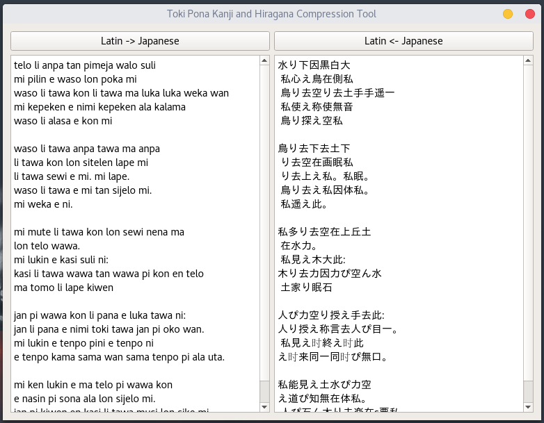

# tokipona-japanese
A program to compress/decompress Toki Pona written with the latin alphabet and Toki Pona using Japanese Kanji and Hirigana
- I got these words from http://tokipona.net/tp/classicwordlist.aspx
- This was a project I threw together in 2016 while bored in class and learning Qt so the code here definitely isn't the best.
- I would like to thank Toki Pona for only having 120 words!


## To build
```
tokipona-japanese $ qmake
tokipona-japanese $ make
```
## To run
- Note: Program must be built before being run
```
tokipona-japanese $ ./tokiponajapanese 
```
